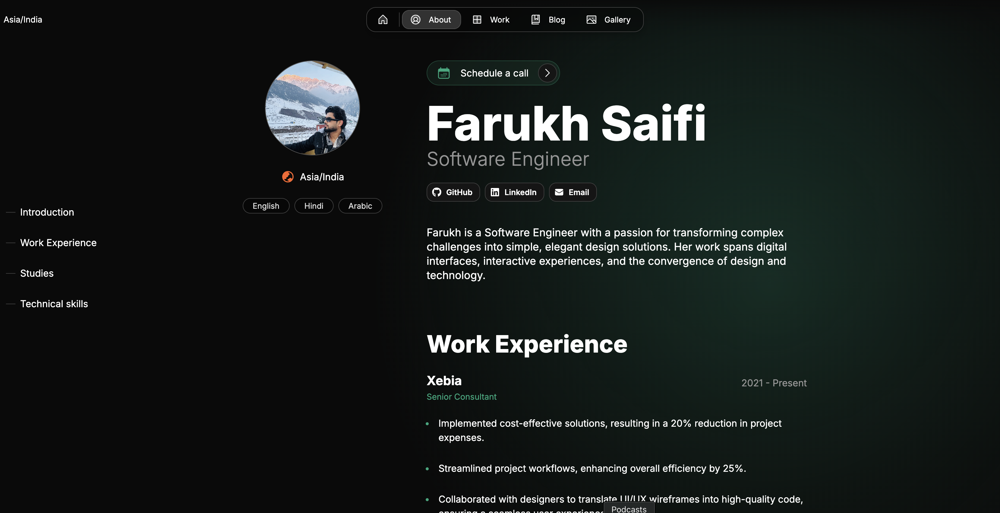

# Farukh Saifi's Portfolio

A modern, clean, and professional portfolio website built with Next.js 16 and Once UI. This portfolio showcases my work as a Software Engineer specializing in MERN Stack development, featuring an MDX-based content system for projects and blog posts, an about/CV page, and a gallery.

View the [demo here](https://farukh.me)



## 🚀 Getting Started

### Prerequisites

- Node.js v18.17 or higher
- npm or yarn package manager

### Installation

**1. Clone the repository**

```bash
git clone https://github.com/FarukhSaifi/magic-portfolio.git
cd magic-portfolio
```

**2. Install dependencies**

```bash
npm install
```

**3. Run development server**

```bash
npm run dev
```

Open [http://localhost:3000](http://localhost:3000) in your browser to see the result.

**4. Configure your portfolio**

Edit the configuration file:

```
src/resources/once-ui.config.ts
```

**5. Update your content**

Edit your personal information, work experience, and projects:

```
src/resources/content.tsx
```

**6. Add blog posts and projects**

Create new `.mdx` files in:

- Blog posts: `src/app/blog/posts/`
- Projects: `src/app/work/projects/`

## ✨ Features

### 🔍 SEO Optimized

- Automatic Open Graph and X (Twitter) image generation with `next/og`
- Automatic schema.org structured data and metadata generation
- Optimized for search engines

### 🎯 Design

- **Responsive Layout**: Optimized for all screen sizes (mobile, tablet, desktop)
- **Timeless Design**: Clean, professional aesthetic without heavy animations
- **Customizable**: Endless customization options through [data attributes](https://once-ui.com/docs/theming)
- **Dark Mode**: Built-in theme support

### 📝 Content Management

- **MDX Support**: Write blog posts and project descriptions in MDX format
- **Conditional Rendering**: Show/hide sections based on content configuration
- **Flexible Pages**: Enable or disable pages for blog, work, gallery, and about/CV
- **Social Links**: Automatically generate and display social media links
- **Password Protection**: Set up password protection for specific routes

### 🌐 Internationalization

- A localized version of Magic Portfolio is available with the next-intl library
- To use localization, switch to the 'i18n' branch

## 🛠️ Tech Stack

- **Framework**: [Next.js 16](https://nextjs.org) with App Router
- **UI Library**: [Once UI System](https://once-ui.com) - Core components
- **Styling**: SCSS with CSS Modules
- **Content**: MDX for blog posts and projects
- **Language**: TypeScript
- **Deployment**: Optimized for Vercel

## 📦 Project Structure

```
src/
├── app/                    # Next.js App Router pages
│   ├── about/             # About page
│   ├── blog/               # Blog pages and posts
│   ├── work/               # Work/projects pages
│   ├── gallery/            # Gallery page
│   └── layout.tsx          # Root layout
├── components/              # React components
│   ├── about/              # About page components
│   ├── blog/               # Blog components
│   └── work/               # Work/projects components
├── resources/               # Configuration and content
│   ├── content.tsx         # Personal info, work experience, etc.
│   ├── once-ui.config.ts   # UI configuration
│   └── icons.ts            # Custom icons
└── types/                  # TypeScript type definitions
```

## 🎯 Key Sections

### Home Page

- Hero section with introduction
- Featured projects
- Latest blog posts
- Newsletter subscription

### About Page

- Personal introduction
- Work experience timeline
- Education background
- Technical skills showcase
- Social media links

### Work/Projects Page

- Grid layout showcasing projects (2x2 on desktop)
- Project case studies with MDX content
- Links to GitHub repositories
- Project images and descriptions

### Blog Page

- MDX-based blog posts
- SEO optimized
- Share functionality
- Reading time estimates

### Gallery Page

- Photo gallery with masonry layout
- Horizontal and vertical image support

## 🔧 Configuration

### Environment Variables

Create a `.env.local` file:

```env
PAGE_ACCESS_PASSWORD=your-password-here
```

### Customization

1. **Personal Information**: Edit `src/resources/content.tsx`
2. **UI Theme**: Edit `src/resources/once-ui.config.ts`
3. **Styling**: Modify SCSS files in `src/components/`
4. **Icons**: Add custom icons in `src/resources/icons.ts`

## 📝 Adding Content

### Create a Blog Post

Create a new `.mdx` file in `src/app/blog/posts/`:

```mdx
---
title: "My Blog Post Title"
publishedAt: "2025-01-20"
summary: "A brief summary of the post"
---

## Introduction

Your blog post content here...
```

### Create a Project

Create a new `.mdx` file in `src/app/work/projects/`:

```mdx
---
title: "Project Name"
publishedAt: "2025-01-20"
summary: "Project description"
images:
  - "/images/projects/project-01/cover-01.jpg"
team:
  - name: "Your Name"
    role: "Role"
    avatar: "/images/avatar.jpg"
link: "https://github.com/yourusername/project"
---

## Overview

Your project description...
```

## 🚀 Deployment

### Deploy to Vercel

The easiest way to deploy is using [Vercel](https://vercel.com):

1. Push your code to GitHub
2. Import your repository in Vercel
3. Vercel will automatically detect Next.js and deploy

### Build for Production

```bash
npm run build
npm start
```

## 📄 License

This project is open source and available under the [MIT License](LICENSE).

## 👨‍💻 About Me

**Farukh Saifi** - Software Engineer | MERN Stack

- 📍 Location: New Delhi, India
- 💼 Currently: Senior Consultant at Xebia India
- 🌐 Website: [www.farukh.me](https://www.farukh.me)
- 📧 Email: <farook1x95@gmail.com>
- 💻 GitHub: [@FarukhSaifi](https://github.com/FarukhSaifi)
- 💼 LinkedIn: [farukh-saifi](https://www.linkedin.com/in/farukh-saifi)

## 🙏 Acknowledgments

- Built with [Once UI System](https://once-ui.com)
- Portfolio template by [Once UI System](https://github.com/once-ui-system/magic-portfolio)
- Powered by [Next.js](https://nextjs.org)

---

**Built with ❤️ by Farukh Saifi**
